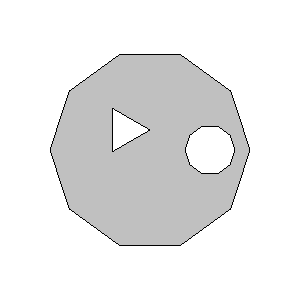
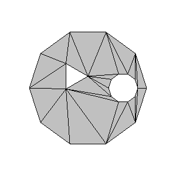
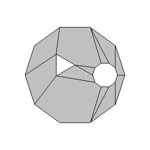

## poly-partition-js

Modified from [PolyPartition](https://github.com/ivanfratric/polypartition).

#### Functions

* `removeHoles(polygon: Contour, holes: Contour[], doNotCheckOrdering?: boolean): Contour`
* `triangulate(polygon: Contour, doNotCheckOrdering?: boolean): Contour[]`
* `convexPartition(polygon: Contour, doNotCheckOrdering?: boolean): Contour[]`

`Contour` is `{ x: number, y: number }[]`, counterclockwise for non-holes, clockwise for holes.

#### Example

Inputs:



```javascript
const merged = removeHoles(polygon, [hole1, hole2], true);
```


```javascript
const triangles = triangulate(merged, true);
```



```javascript
const convexes = convexPartition(merged, true);
```




https://medium.com/machine-words/constructing-a-navigation-mesh-in-node-js-c4addd3700f1


    polygon-clipping 是一个用于对多边形进行高效布尔运算的库——并集、交集、差集等等。
    rbush 是 R-Trees 的一个实现，可以在 2D 空间内快速搜索对象。
    polygon-partition是一种将复杂的多边形分解成更小的凸多边形的算法。 请注意，我不得不分叉该库以对算法进行轻微调整 —原始库未处理的边缘情况，请参阅此 GitHub 问题了解详细信息。
